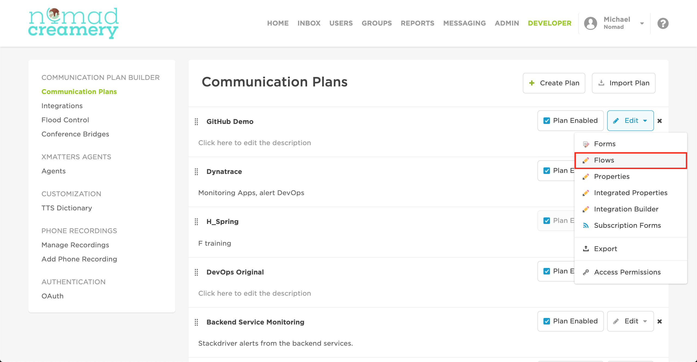
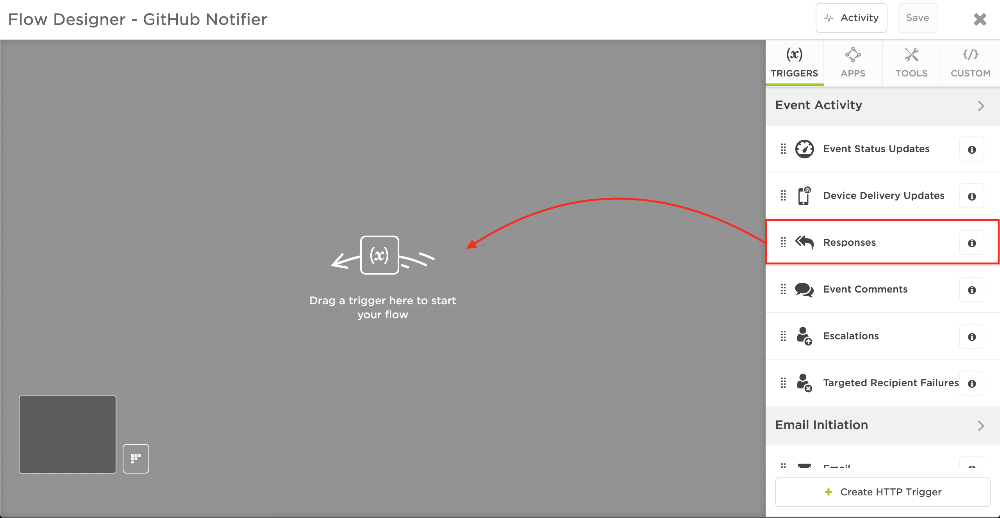
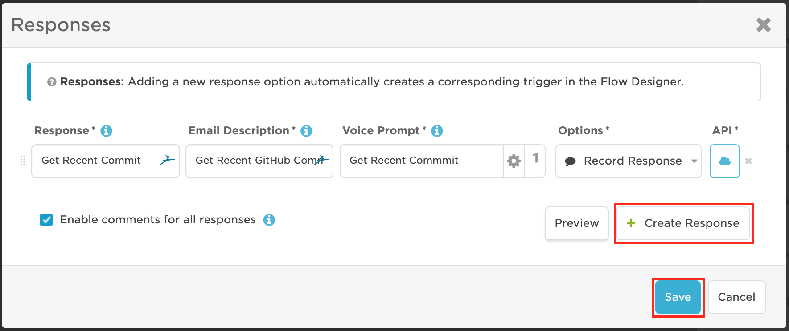
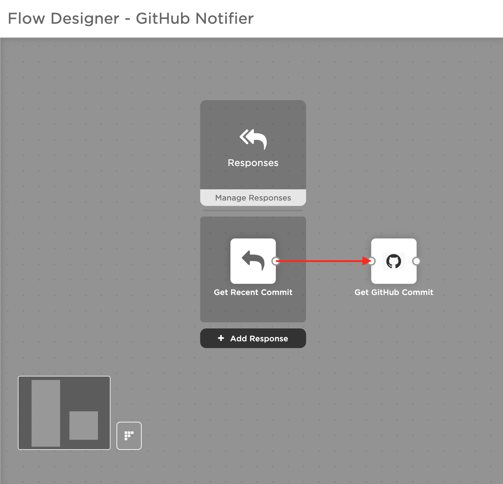

# GitHub <--> xMatters integration
This is part of the xMatters Labs awesome listing. For others, see [here](https://github.com/xmatters/xMatters-Labs)
With this library, you can easily grab commits from GitHub into an xMatters flow for use with other integrations.

This document details how to install and use this integration. 

---------

<kbd>

</kbd>

---------
# Pre-Requisites
* xMatters account - If you don't have one, [get one](https://www.xmatters.com)! 
* An xMatters Communication Plan with a created form
* GitHub Repo from which you would like to pull recent commits

# Files
* [script.js](./script.js) - This is the script to paste into the custom step, which gets the most recent commit from GitHub

# Introduction - How it works
GitHub is the largest version control application for software development using Git, and being able to access recent comitts inside an xMatters Flow can be useful for creating a seamless deployment pipeline or simply for easy development. 

# Installation
## Prerequisites:
An existing Communication Plan in xMatters for which you would like to add a GitHub `Get Recent Commit` custom step to your flow.

## Adding GitHub to xMatters
1. Inside your xMatters instance, navigate to the Developer tab
2. Locate the Communication Plan you would like to add a GitHub step to, then click **Edit** > **Flows**

3. For the Form you would like to add Zoom options to (or if you already have a flow, open that flow), click on **Create Flow**
4. Click and drag **Responses** into the flow, then click **Save**

5. Create a new Response by clicking **Add Response** or by double clicking the `Responses` step
6. Click Create Response to add a new response
7. Fill in a new Response that describe a step to build your Jenkins pipeline, then click **Save**

8. On the righthand side, click on the **Custom** tab, then click **+ Create a custom action**
9. In the settings tab, fill out the info as follows, then click **Save** (note: endpoint label is case sensitive):

| Option                     | Value                                   |
| ---------------------- | ------------------------------- |
| Name                      | Get GitHub Commit            |
| Description             | Get recent commit from GitHub |
| Include Endpoint    | **✓**                                     |
| Endpoint Type        | Basic                                    |
| Endpoint Label       | GitHub                                 |

10. In the inputs tab, add these two inputs, then click **Save**:

| Name | Required Field | Minimum Length | Maximum Length | Help Text | Default Value | Multiline |
| ------- | ---------------- | -------------------- | -------------------- | ----------- | --------------- | --------- |
| Username | **✓** | 0 | 2000 | GitHub username |  |  |
| Repository | **✓** | 0 | 2000 | GitHub repository |  |  |
* Note that the repository must be owned by the account with the supplied username

11. In the script tab, paste in [this](./script.js) script, then click **Save**
12. Now you've made your custom action, which you can reuse as much as you want, changing the `Repository` and its corresponding `Username`  to change from which repo commits are pulled.

## Adding the step to a flow
1. In your flow, click and drag the custom **Get GitHub Commit** action into the flow
2. Connect your GitHub response option to your custom **Get GitHub Commit** action in the flow

3. In the flow, double click the **Get GitHub Commit** custom step, or click the pencil to edit it
4. Fill in the input values in the **Setup** tab, for example

| Username | Repository | 
| --- | --- |
| michael-sorenson | xm-labs-github |

5. In the **Endpoint** tab, click **Create New Endpoint**
6. Fill in the endpoint with the following values, then click **Save Changes**

| Name | Base URL | Trust self-signed certficiates | Authentication Type | Username | Password |
| --- | --- | --- | --- | --- | --- |
| GitHub | https://api.github.com | | Basic | MY_GITHUB_USERNAME | MY_GITHUB_PASSWORD |

7. Close out of the endpoint editor, then click OK to save the custom step, then click **Save** to save the flow
8. Enjoy gitting your commits :)

# Testing
To test the integration, fire the xMatters outbound notifier and select the GitHub response option. If it works, the pipeline will run, which you can see in the Activity monitor inside the Flow Designer (in the top righthand side of the Flow) -- if you click the GitHub response, then open the Log, you should see a green check mark and that the flow is completed; if you see an error, see **Troubleshooting**

# Troubleshooting
If the integration is not working properly, there are a few places where it could be going wrong.
1. Check that you created all the inputs and outputs correctly, note that they are case sensitive
2. Check that you defined the endpoint correctly and re-enter your GitHub username and password; note that the endpoint name is case sensitive
